# GlusterFS Distributed File System Assignment
glusterfs assignment

## Project Overview

This project demonstrates the deployment of a distributed file system using GlusterFS within a Linux virtual machine environment.

The system was built using:

- Ubuntu 64-bit as a storage node
- Linux Mint as a storage node and web server
- Kali Linux as a client machine

The aim of this project was to configure shared storage, implement replication, test fault tolerance, and integrate the storage system with an Apache web server.

---

## System Architecture

| Machine | Role | IP Address |
|---|---|---|
| Ubuntu 64-bit | GlusterFS storage node | 192.168.206.131 |
| Linux Mint | GlusterFS storage node + Apache web server | 192.168.206.130 |
| Kali Linux | Client system | DHCP / same network |

---

## GlusterFS Configuration

GlusterFS was installed on Ubuntu and Linux Mint. Both machines were connected as peers and configured to use a replicated volume.

The volume used was: `gv0`

## Screenshots

### GlusterFS Setup
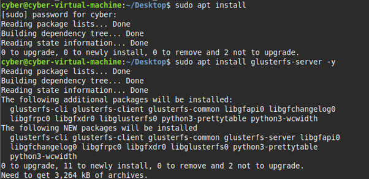

This screenshot shows the initial GlusterFS setup and confirms that the storage system was being configured across the virtual machines.

### Volume Info (Replicated)
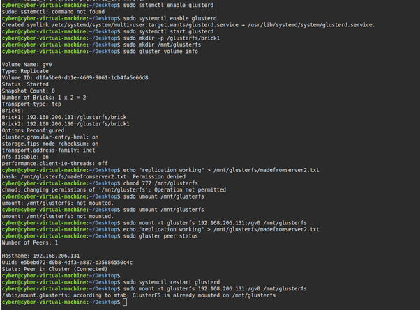

This screenshot shows the volume information after replication was enabled. It confirms that the GlusterFS volume was running in replicated mode with two bricks.

### Apache Running
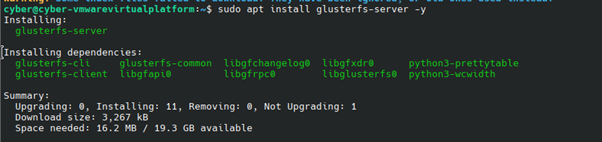

This screenshot shows the Apache web server running successfully on the Linux Mint machine.

### Web Server Output
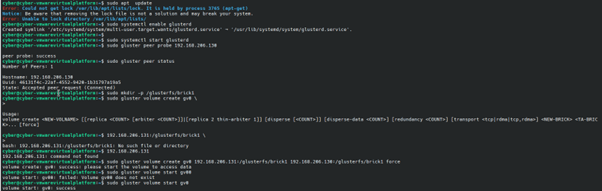

This screenshot shows the web server being accessed through the browser using the Linux Mint IP address. The page displayed “Gluster Web Server”, confirming that the web server was working.

### Replication Test (Client Access from Kali)
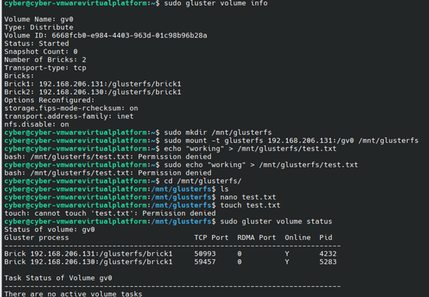

This shows the Kali Linux client successfully mounting the GlusterFS volume and accessing files stored on the servers.

---

### File Creation from Client (Kali)
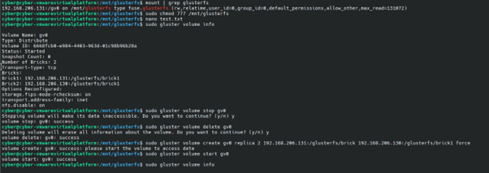

A file was created from the Kali client and written to the shared GlusterFS volume, demonstrating that external systems can write to the distributed storage.

---

### File Verification on Server
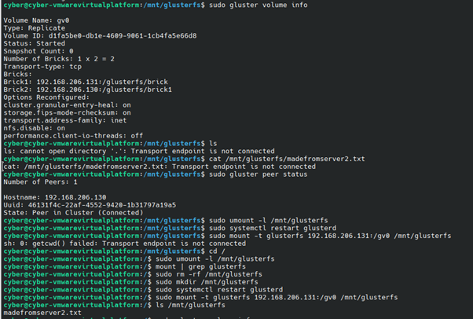

The file created from Kali was accessed on the server, confirming that data is synchronised across nodes.

---

### Replicated Volume Configuration
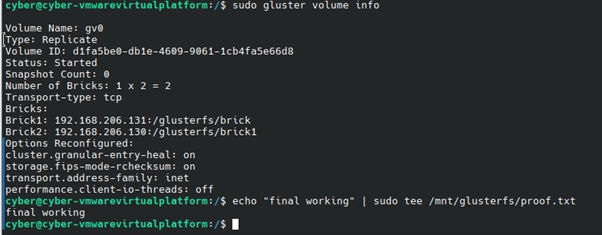

This shows the GlusterFS volume configured as a replicated volume, ensuring data redundancy across both nodes.

---

### Failover Test – Error Encountered
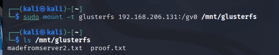

During testing, the system encountered a “Transport endpoint is not connected” error, showing a mount instability issue.

---

### Troubleshooting and Fix
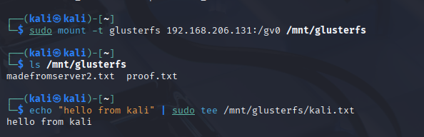

The issue was resolved by unmounting the GlusterFS volume, restarting the service, and remounting it.

---

### Volume Recreation (Replication Fix)
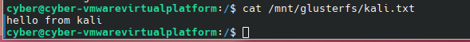

The volume was recreated using a replicated configuration to ensure fault tolerance and improved reliability.

---

### Initial Distributed Volume Setup
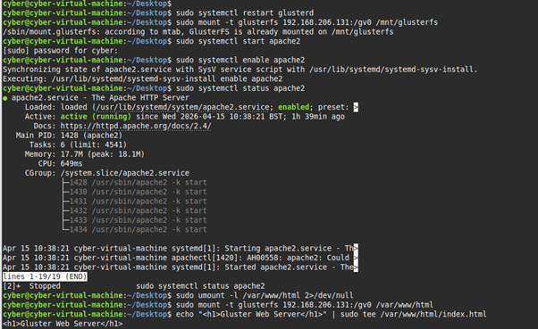

This shows the initial setup using a distributed volume before replication was implemented.

---

### GlusterFS Installation
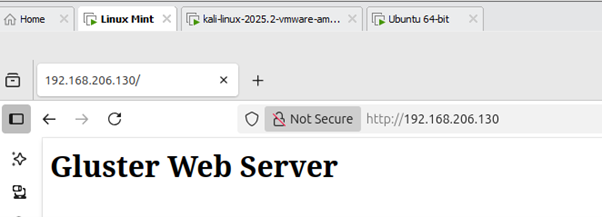

GlusterFS was installed on both machines, providing the foundation for the distributed storage system.

